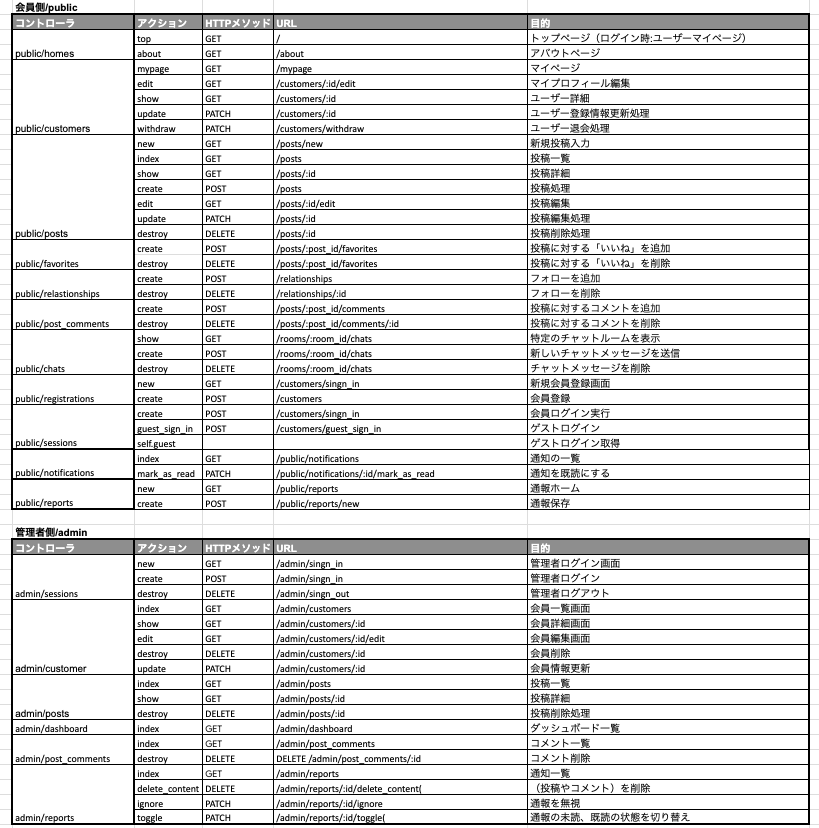

# にゃんずBook

## サイト概要
### サイトテーマ
飼い猫の代わりに飼い主が投稿するコミュニティーサイト 
 1.写真ギャラリー: メンバーが自分の猫の写真をアップロードして共有できる。 
 2.猫のストーリー: 猫のエピソードや日常の出来事を投稿する。 
 3.情報共有: 猫の飼育方法、健康管理、グッズのレビューなどの情報を共有する。 
 4.イベント情報: 猫に関連するイベントやオフ会の情報を提供。 
 5.交流機能: メンバー同士が質問や意見交換を行える。 
​
### テーマを選んだ理由
　私自身、猫との生活は生まれた時から現在まで欠かせないものでした。 
猫にも性格*があり、人と同じように感情を表現してくれる愛くるしい家族です。 
今では、猫や犬などの動物をペットの枠を超えて、家族の一員として大切に思う人々が多くなっているのではないでしょうか。 
　しかし、まだ多くの社会的仕組みの中には、動物を家族として受け入れる体制が整っていないのが現状です。 
　 
　例えば、災害時の避難場所ではペットと一緒に入れる場所が少ないことで、避難者にとってさらに悩みが増えるという現実があります。 
この状況はとても悲しく、心を打たれました。そこで、このコミュニティーを通じて、猫好き同士が助け合える場を作りたいと考え、このサイトを立ち上げました。 
 
　他にも同じようなサイトがあるかもしれませんが、ここでの特徴としては、猫の気持ちを汲み取り、飼い主が猫になり代わって投稿するという点です。 
これにより、飼い主が猫の気持ちに寄り添う力を養うことができると考えています。
 
　猫の感情や意思を理解することの重要性は、多くの科学的研究でも支持されています。 
例えば、猫は人間の感情を認識し、それに応じて行動することが確認されており、彼らが感情豊かで複雑な意思を持つことが明らかにされています。 
こうしたエビデンスを背景に、猫との絆を深め、コミュニティ内で助け合いの輪を広げることを目指しています。 
 
　また、サイトを運営する上での資金収集では広告収入が見込みやすと考えました。 
広告を掲載する可能性が高い企業の例では6つほど考えられます。 
1.ペットフードメーカー 
　猫の健康と栄養に関心を持つ飼い主が多いため、ペットフードメーカーは主要な広告主となり得ます。 
2022年の日本のペットフード市場規模は6,083億円**で、ペット関連商品の国内市場の中で3割以上を占めています。 
 
　この成長は、ペットの人間化や高品質なペットフードへの需要増加によるものです。特に消費者はペットの健康と福祉に関心を持ち、 
ナチュラルやオーガニック製品が人気を集めています。これらのデータから、日本のペットフード市場は今後も成長が見込まれており、 
特に高品質な製品への需要が高まっています。 
2.ペット用品メーカー 
　猫のおもちゃ、ベッド、トイレ用品などを提供する企業は、猫の飼い主に向けた広告を掲載する価値があります。 
3.獣医関連サービス 
獣医クリニック、ペット保険、オンライン獣医相談などのサービスを提供する企業も有望な広告主です。 
4.ペットシッター・ペットホテル 
ペットシッターやペットホテルのサービスを提供する企業も、猫の飼い主に向けた広告を掲載する可能性があります。 
5.ペット保険 
ペット保険会社も、猫の健康を守りたい飼い主に向けた広告を出す可能性があります。 
6.ペット関連のメディアやイベント 
ペットに関する雑誌、ブログ、イベントを運営している企業も広告主として考えられます。 

  *猫の認知と性格に関する研究の進展 https://link.springer.com/chapter/10.1007/978-981-16-2028-7_17 
   猫の行動、認知、人間と猫の関わり https://www.mdpi.com/journal/animals/special_issues/cats_behaviors 
 **2024年ペットビジネス市場規模は？今後の展望 https://petopro.net/1472/#co-index-3 

### ターゲットユーザ
- 猫を飼っている人
- 猫が好きな人
- 猫をこれから飼いたい人
- 猫に対して何か貢献したい人

### 主な利用シーン
1.猫が何か訴えた時に今の気持ちを投稿 
    　猫が特定の行動をしたり、特別な鳴き方をしたときに、その状況を共有し、他の飼い主の意見やアドバイスを求める。 
2.猫のグッズを使った時の感想を投稿 
    　新しいおもちゃやキャットフード、ベッドなどを使用した際の猫の反応や使い心地のレビューを共有する。 
3.猫の写真で癒されたい時に他の人の投稿を観覧する 
    　他のメンバーが投稿した可愛い猫の写真や動画を見てリラックスしたり、癒しを得る。 
4.猫の健康や行動について相談する 
    　猫の健康や行動に関する疑問や悩みを投稿し、経験豊富な飼い主や専門家からのアドバイスを受ける。 
5.猫に関するイベント情報を共有・確認する 
    　地域で開催される猫に関するイベントやセミナー、ワークショップの情報を共有し、参加の呼びかけをする。 
6.猫の里親募集や譲渡情報の共有 
    　猫の里親募集や譲渡に関する情報を投稿し、新しい飼い主を探す手助けをする。 
7.猫に関連するニュースやトピックスを共有する 
    　猫に関する最新のニュースや研究成果、トピックスを共有し、コミュニティ内での知識を深める。 
8.猫のしつけやトレーニング方法を学ぶ 
    　猫のしつけやトレーニングに関する記事や動画を投稿し、飼い主同士で効果的な方法を学び合う。 
9.猫と一緒に楽しめる場所や旅行情報の共有 
    　猫と一緒に行けるカフェや公園、旅行先の情報を共有し、猫との生活をさらに豊かにするアイデアを提供する。 
## 設計書

​
## 開発環境
- OS：Linux(CentOS)
- 言語：HTML,CSS,JavaScript,Ruby,SQL
- フレームワーク：Ruby on Rails
- JSライブラリ：jQuery
- IDE：Cloud9
​
## 使用素材
AdobeExpress